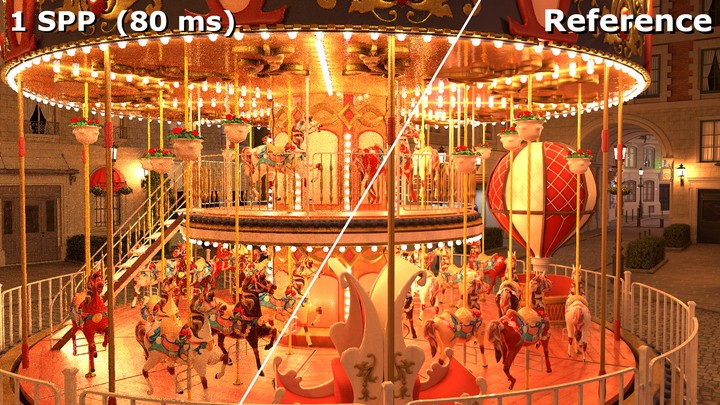
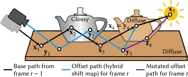

# ReSTIR Path Tracing (ReSTIR PT)

## Overview

This project implements the **ReSTIR Path Tracing (ReSTIR PT)** algorithm, a state-of-the-art technique designed to improve real-time global illumination in complex scenes with challenging (highly specular) materials. ReSTIR PT was originally proposed by Daqi Lin in his SIGGRAPH 2022 paper [*Generalized Resampled Importance Sampling: Foundations of ReSTIR*](https://dqlin.xyz/pubs/2022-sig-GRS/). Besides the original paper, my understanding, debugging, and README also heavily depend on the SIGGRAPH 2023 Course [A Gentle Introduction to ReSTIR](https://intro-to-restir.cwyman.org/).

ReSTIR PT extends the [original ReSTIR](https://benedikt-bitterli.me/restir/) (Resampled Importance Sampling for Direct Illumination, also referred as ReSTIR DI) by enabling **full path tracing with spatiotemporal reuse**. While ReSTIR DI focuses on efficient resampling for direct illumination, ReSTIR PT adapts this resampling to full global illumination, including indirect bounces. It leverages the same core principles—resampling and reservoir-based spatiotemporal reuse—but extends them to handle multi-bounce paths efficiently.

Thus, ReSTIR PT excels in real-time rendering by producing high-quality images even within a single frame.

## About Falcor

[**Falcor**](https://github.com/NVIDIAGameWorks/Falcor/) is a highly flexible and extensible real-time rendering framework developed by NVIDIA. It serves as the backbone for implementing modern rendering algorithms, including ray tracing and path tracing. This project utilizes Falcor’s capabilities to manage the rendering pipeline, shader compilation, and resource handling, enabling seamless experimentation with the ReSTIR PT algorithm.

## Rendering Results & Comparison

### Against Path Tracing in Equal Time

The following equal-time comparison demonstrates the effectiveness of ReSTIR PT: single-frame rendering quality better than that of multi-frame baseline path tracing (PT). ReSTIR PT renders at ~12 fps, while PT at ~106 fps.

- left: baseline path tracing after 9 frames
- middle: image shows ReSTIR PT's output in a single frame.
- right: mid combined with denoising (OptiX denoiser)

### Effectiveness of Spatial and Temporal Reuse

It has been well established that, temporal reuse alone gives a big performance upgrade, while spatial reuse along does not. Combined together is the fundamental of ReSTIR.

top-left: single-frame PT; top-right: spatial reuse only; bottom left: temporal reuse only; bottom-right: ReSTIR PT

### Shifting Mapping Strategy Comparison

Shift mapping strategy is the key technical detail on how to merge with spatial and temporal neighbor reservoirs. For more info, see [Technical Details Section](#technical-details) below, the Course, and the original paper.

To summarize, random replay achieves good rendering quality, but are slow; reconnection shift is fast, but it fails on high specular materials, like the glass teapot in the scene. Hybrid shift combines these 2 ideas and achieve both good quality and speed.

Here is the FPS:

- Reconnection: 22.8 fps, 43.9 ms
- Hybrid: 12.2 fps, 81.8 ms
- Random Replay: 6.4 fps, 154 ms

And the obvious failure of reconnection shift on the left:

## Converged Rendering Result

There is one thing to keep in mind: ReSTIR PT rendering is slightly dimmer than the baseline path tracing. (But personally I prefer the dimmer one, anyone the same?)

## Technical Details

The implementation of **ReSTIR PT** involves a few core concepts that extend the principles of the original ReSTIR algorithm, adapting them to path tracing. Here are the key ideas:

1. **Resampled Importance Sampling (RIS)**:
   - ReSTIR PT uses **Resampled Importance Sampling (RIS)** to select important light samples based on multiple importance sampling (MIS) weights. This technique blends samples from different distributions, such as the **BSDF** (Bidirectional Scattering Distribution Function) and **Next Event Estimation (NEE)**:
    $$w_i = \frac{f(x_i)}{p(x_i)}$$
    where $w_i$ is the MIS-adjusted weight, $f(w_i)$ is the contribution of the sample $x_i$, and $p(x_i)$ is its probability density.

2. **Spatiotemporal Reservoir Resampling**:
   - ReSTIR DI introduces **spatiotemporal reuse** of reservoirs. These reservoirs at each pixel incorporate some information of primary-hit sample from both spatial neighbors and past frames. The reuse/resampling is completed or rejected based on some primary-hit info available in G-buffer.
   - ReSTIR PT extends it to a path reservoir that stores more information about the full path. A more sophisticated path reuse framework, shift mapping (see below), and 3 shifting mapping strategies enable correct and efficient reservoir resampling in path space. These adaptations allow ReSTIR PT to effectively handle path tracing, leveraging previous information to enhance sample efficiency and reduce variance over time:
     $$R = \frac{\sum_{i=1}^N w_i}{\sum_{j=1}^M w_j}$$
     where $R$ represents the reservoir resampling ratio, aggregating weights from $N$ (usually 1) candidates and adjusting with historical samples from $M$ reservoirs.

3. **Reusing Samples Between Domains**:

There are 3 main shift mapping strategies available in the renderer. to ensure efficient reuse of samples across different domains:

- **Reconnection Shift**: This strategy maps a path to another neighbor path, reconnecting the deterministic beginning (camera position x0 and primary hit x1) to the same secondary vertex x2. It works well for diffuse
and rough surfaces, but not for glossy or specular surfaces, as it does not
respect the law of ideal reflection.
- **Random Number Replay**: copies the base path's
random numbers at each bounce to re-trace the next bounce with the
method used by the base path. It usually makes decisions similar to
copying the half-vector or direction (depending on the BSDF type),
or a light source's position in the case of next-event-estimation.
- **Hybrid Shift**: The hybrid shift combines the benefits of both and only requires constant additional storage per pixel - only a reconnection vertex and a random-number generating seed.

***Other implementation details can be found from the course note and the original paper.***

## Reference List

- "Falcor: A Real-Time Rendering Framework," NVIDIA Research. [Falcor GitHub](https://github.com/NVIDIAGameWorks/Falcor)
- Daqi Lin*, Markus Kettunen*, Benedikt Bitterli, Jacopo Pantaleoni, Cem Yuksel, and Chris Wyman. 2022. Generalized Resampled Importance Sampling: Foundations of ReSTIR. ACM Transactions on Graphics (Proceedings of SIGGRAPH 2022) 41, 4 (July 2022), 75:1-75:23. DOI:https://doi.org/10.1145/3528223.3530158
- Chris Wyman, Markus Kettunen, Daqi Lin, Benedikt Bitterli, Cem Yuksel, Wojciech Jarosz, Pawel Kozlowski, and Giovanni De Francesco. 2023. A Gentle Introduction to ReSTIR: Path Reuse in Real-time. In ACM SIGGRAPH 2023 Courses, Los Angeles, California. DOI:https://doi.org/10.1145/3587423.3595511
- Benedikt Bitterli, Chris Wyman, Matt Pharr, Peter Shirley, Aaron Lefohn, and Wojciech Jarosz. 2020. Spatiotemporal reservoir resampling for real-time ray tracing with dynamic direct lighting. ACM Transactions on Graphics (Proceedings of SIGGRAPH) 39, 4 (July 2020). DOI:https://doi.org/10/gg8xc7
